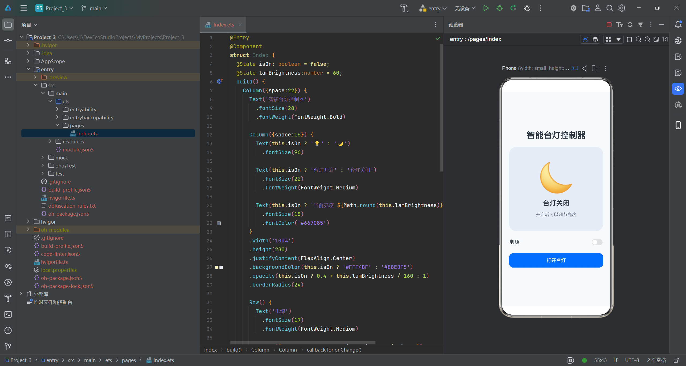
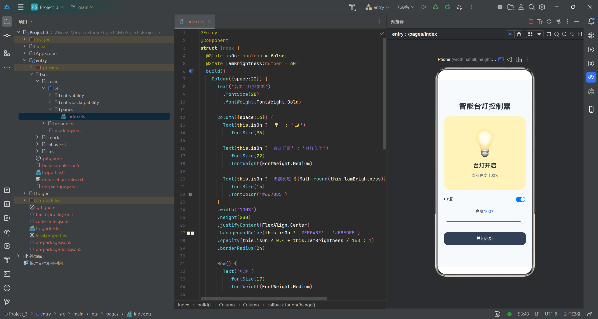
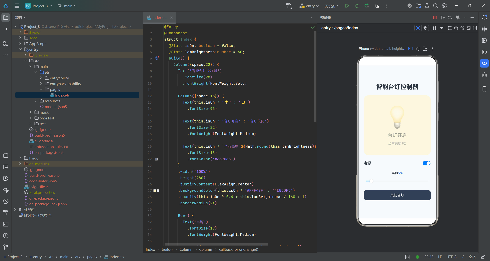

# isON原理
isOn 是台灯的总开关状态，当它从 false 变为 true 或从 true 变为 false 时，ArkUI 会重新更新所有依赖它的组件：按钮会切换“打开台灯”和“关闭台灯”的文字及颜色，状态文字会切换“台灯已开启”和“台灯已关闭”，卡片背景会在浅黄色和灰蓝色之间变化，滑块则只在 isOn 为 true 时显示，因此事件只需要修改 isOn，界面的其他变化都会根据这个状态自动完成。

## 修改部分
**修改前**
```代码
Slider({value:this.lampBrightness, min:10, max:90, step:10})
```
**修改后**
```代码
Slider({value:this.lampBrightness, min:1, max:100, step:1})
```
步长更小，min更小，max更大，滑块拖动更丝滑

# 截图



