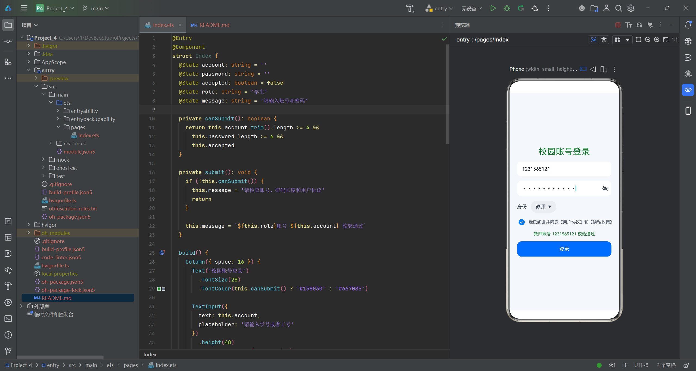
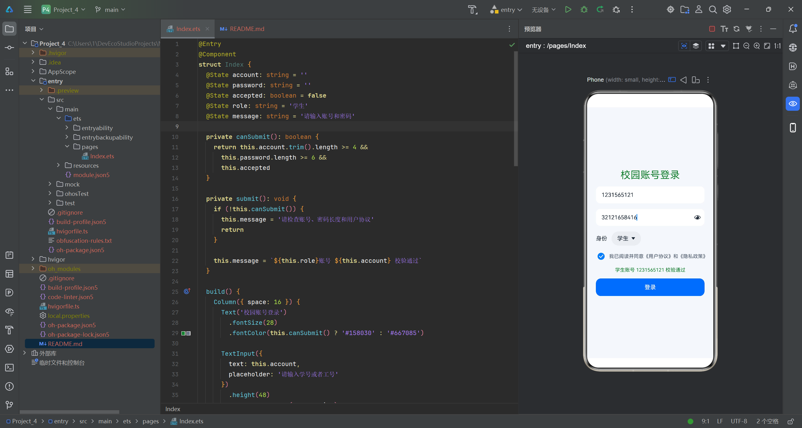
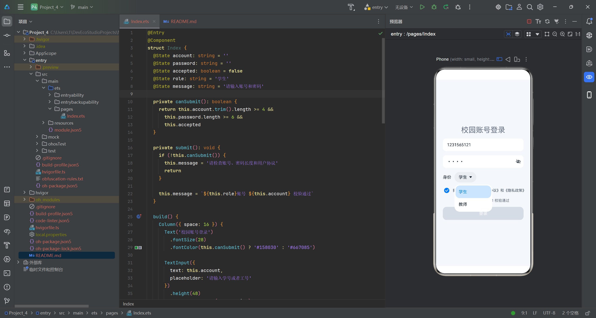

## 状态表

| 状态名称     |  数据类型   |     初始值      | 保存的内容      | 发生变化的时机 |
|:---------|:-------:|:------------:|:-----------|---------|
| account  | string  |     `''`     | 用户输入的学号或工号 | 用户在账号输入框中输入内容时        |
| password | string  |     `''`     | 用户输入的密码    |   用户在密码输入框中输入内容时      |
| accepted | boolean |   `false`    | 用户是否勾选用户协议 |    用户勾选或取消勾选复选框时     |
| role     | string  |    `'学生'`    | 用户选择的身份    |     用户在下拉选择框中切换身份时    |
| message  | string  | `'请输入账号和密码'` | 当前表单提示信息   |    用户点击登录按钮并执行校验时     |

